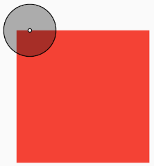
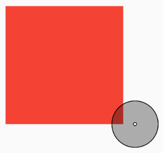
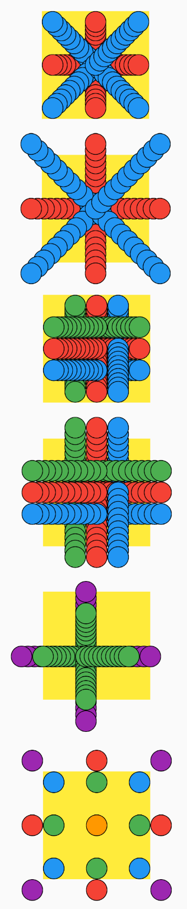
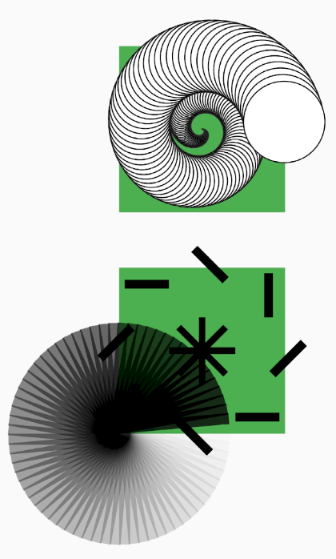

[](https://mytext.ai)

[](https://pub.dartlang.org/packages/align_positioned)

# align_positioned

Widgets in this package:

* `AlignPositioned`
* `AnimatedAlignPositioned`
* `AnimChain`

**Why are these widgets an indispensable tool?**

When your desired layout feels too complex for Columns and Rows, `AlignPositioned` is a real
lifesaver. Flutter is very composable, which is good, but sometimes it's unnecessarily complex to
translate some layout requirement into a composition of simpler widgets.

The `AlignPositioned` aligns, positions, sizes, rotates and transforms its child in relation to both
the container and the child itself. In other words, it lets you **easily and directly** define where
and how a widget should appear in relation to another.

For example, *you can tell it to position the top-left of its child at 15 pixels to the left of the
top-left corner of the container, plus move it two thirds of the child's height to the bottom plus
10 pixels, and then rotate 15 degrees.*
Do you even know how to start doing this by composing basic Flutter widgets? Maybe, but
with `AlignPositioned` it's much easier, and it takes a single widget.

Besides layout, `AlignPositioned` is specially helpful for **explicit animations**
(those that use a `controller`), since you can just calculate the final position, size and rotation
you want for each frame. Without it, you may find yourself having to animate a composition of
widgets.

Meanwhile, `AnimatedAlignPositioned` and `AnimChain` widgets are helpful for
**implicit animations**, which are very easy to create. If you change their parameters they animate
automatically, interpolating between the old and new parameter values.

## How it works

Add align_positioned
[as a dependency](https://pub.dartlang.org/packages/align_positioned#-installing-tab-)
in your `pubspec.yaml` file, then import it:

    import 'package:align_positioned/align_positioned.dart';

Pass a `child` to the `AlignPositioned` or the `AnimatedAlignPositioned`, and then one or more of
the following parameters:

    AlignPositioned(
       child: child,
       alignment: ...,
       dx: ...,
       dy: ...,
       moveByChildWidth: ...,
       moveByChildHeight: ...,
       moveByContainerWidth: ...,
       moveByContainerHeight: ...,
       moveVerticallyByChildWidth: ...,
       moveHorizontallyByChildHeight: ...,
       moveVerticallyByContainerWidth: ...,
       moveHorizontallyByContainerHeight: ...,
       childWidth: ...,
       childHeight: ...,
       minChildWidth: ...,
       minChildHeight: ...,
       maxChildWidth: ...,
       maxChildHeight: ...,
       childWidthRatio: ...,
       childHeightRatio: ...,
       minChildWidthRatio: ...,
       minChildHeightRatio: ...,
       maxChildWidthRatio: ...,
       maxChildHeightRatio: ...,
       rotateDegrees: ...,
       matrix4Transform: ...,
       wins: ...,
       touch: ...,
       );

Let's study each parameter in detail:

## Align and Position parameters

The `alignment` parameter works as expected. For example,
`Alignment.bottomRight` represents the bottom right of the container, and `Alignment(0.0, 0.0)`
represents the center of the container. The distance from -1.0 to +1.0 is the distance from one side
of the rectangle to the other side of the rectangle.

If `touch` is `Touch.inside`, then `alignment` works just like the alignment for the `Align` widget,
aligning the child inside the container.

However, if `touch` is `Touch.outside`, then the alignment happens outside the container; and if
it's `Touch.middle`, the center of the child will be aligned to the container edge.

As another example, if `touch` is `Touch.inside`, then `Alignment(1.0, 0.0)` makes the child's right
side touch the right side of the container (it touches the container from the **inside**).

But if `touch` is `Touch.outside`, then `Alignment(1.0, 0.0)` makes the child's left side touch the
right side of the container (it touches the container from the **outside**).

But if `touch` is `Touch.middle`, then `Alignment(1.0, 0.0)` makes the child's center touch the
right side of the container (it touches the container from the **middle**).

Parameters `dx` and `dy` can be positive or negative, and move the child horizontally and
vertically, in pixels.

Parameters `moveByChildWidth` and `moveByChildHeight` can be positive or negative, and move the
child horizontally and vertically, but the unit here is not pixels, but child widths and heights.

Parameters `moveByContainerWidth` and `moveByContainerHeight` can be positive or negative, and move
the child horizontally and vertically, but the unit here is not pixels, but container widths and
heights.

Parameters `moveVerticallyByChildWidth`, `moveHorizontallyByChildHeight`,
`moveVerticallyByContainerWidth` and `moveHorizontallyByContainerHeight` allow you to move in some
direction according to the size (width or height) of the orthogonal direction. For example,
while `moveByChildWidth: 0.2` would move **horizontally** by 20% of the child's **width**,
`moveVerticallyByChildWidth` would move **vertically** by 20% of the child's **width**.

## Align and Position Examples

The below image shows the center of the child positioned 15 pixels to the right of the top-left
corner of the container:



    AlignPositioned(
       child: child,
       alignment: Alignment.topLeft,
       touch: Touch.inside,
       dx: 15.0, // Move 4 pixels to the right.
       moveByChildWidth: -0.5, // Move half child width to the left.
       moveByChildHeight: -0.5); // Move half child height to the top.

Then, to move the child one container width to the right, and one container height to the bottom:



    AlignPositioned(
       child: child,
       alignment: Alignment.topLeft,
       touch: Touch.inside,
       dx: 15.0, // Move 4 pixels to the right.
       moveByChildWidth: -0.5, // Move half child width to the left.
       moveByChildHeight: -0.5, // Move half child height to the top.
       moveByContainerWidth: 1.0, // Move one container width to the right.
       moveByContainerHeight: 1.0); // Move one container height to the bottom.

Please <a href="https://github.com/marcglasberg/align_positioned/blob/master/example/lib/main.dart">
try the example</a>
that showcases the effects seen below:



## Size Parameters

Optionally, you can also define the child size:

- `childWidth` is the child width, in pixels.

- `childHeight` is the child height, in pixels.

- `minChildWidth` is the minimum width, in pixels. It has precedence over `childWidth`.

- `minChildHeight` is the minimum height, in pixels. It has precedence over `childHeight`.

- `maxChildWidth` is the maximum width, in pixels. It has precedence over `childWidth`.

- `maxChildHeight` is the maximum height, in pixels. It has precedence over `childHeight`.

- `childWidthRatio` is the child width, as a fraction of the container width. If between 0.0 and
  1.0, the child will be smaller than its container. If more than 1.0, the child will be larger than
  its container. If you define both `childWidthRatio` and `childWidth` they will be added.

- `childHeightRatio` is the child height, as a fraction of the container height. If between 0.0 and
  1.0, the child will be smaller than its container. If more than 1.0, the child will be larger than
  its container. If you define both `childHeightRatio` and `childHeight` they will be added.

- `minChildWidthRatio` is the minimum child width, as a fraction of the container width. It has
  precedence over `childWidth`. If both `minChildWidth` and `minChildWidthRatio`
  are defined, both will be applied (the minimum will be the larger one).

- `minChildHeightRatio`. is the minimum child height, as a fraction of the container height. It has
  precedence over `childHeight`. If both `minChildHeight` and `minChildHeightRatio`
  are defined, both will be applied (the minimum will be the larger one).

- `maxChildWidthRatio` is the maximum child width, as a fraction of the container width. It has
  precedence over `childWidth`. If both `maxChildWidth` and `maxChildWidthRatio`
  are defined, both will be applied (the maximum will be the smaller one).

- `maxChildHeightRatio` is the maximum child height, as a fraction of the container height. It has
  precedence over `childHeight`. If both `maxChildHeight` and `maxChildHeightRatio`
  are defined, both will be applied (the maximum will be the smaller one).

- `wins` decides what happens if the minimum size is larger than the maximum size. If `wins`
  is `Wins.min`, the default, the minimum size will be used. If `wins` is `Wins.max`, the maximum
  size will be used.

## Rotate and Transform

Optionally, you can also define rotation and transformation:

- `rotateDegrees` is the rotation, in degrees (1 turn is 360 degrees). The position of the axis of
  the rotation (the "origin") depends on the
  `alignment` parameter and the parent. So, for example, `Alignment.center`
  means the axis of rotation is at the center of the parent.

- `matrix4Transform` lets you apply any transformation to the child. This
  uses <a href="https://pub.dev/packages/matrix4_transform">Matrix4Transform</a> instead of Matrix4,
  since it's easier to use. However, you can still use Matrix4 directly with the
  constructor `Matrix4Transform.from(matrix4)`.




## One widget relative to another

Use the `AlignPositioned.relative()` factory if you have a main widget, and you want to
position/size/rotate/translate another widget relative to the main one, but the second is **not** a
child of the first.

Example, to center the main _container_ widget, and then put a relative _child_ widget vertically
below it (in the Y-axis):

 ```
 Center(
    child: AlignPositioned.relative(
        container: widgetA(),
        child: widgetB(),
        moveByContainerHeight: 0.5,
        moveByChildHeight: 0.5));
 ```

The `invert` parameter controls which widget overlaps the other. If `invert` is `false` (the
default), the `container` widget is below the `child` widget in the Z-axis (will be painted before).
If `invert` is true, the `container` widget to be on top of the `child` widget, in the Z-axis (will
be painted after).

## Using AlignPositioned inside a Stack

A `Stack` positions its children relative to the edges of its box. The `Stack` documentation
contains this text:

> _In particular, when using a Stack you can't position
> children relative to their size or the stack's own size._

However, by using `AlignPositioned` you can do precisely that:
position (and size, rotate and transform) children relative to their size or the Stack's own size,
and consequently in relation to the other widgets inside the Stack.

If you recall how a `Stack` works, each of its child widgets is either positioned or non-positioned.
The stack sizes itself to contain all the non-positioned children, which are positioned according to
the stacks' `alignment` parameter. Next, the positioned children are laid out.

If you use the `AlignPositioned` default constructor and put it inside a Stack, it will be a **
non-positioned** child.

To create a **positioned** widget, use the `AlignPositioned.expand()` factory. The `AlignPositioned`
will then expand and fix itself to the corners of the `Stack`. In other words, the `Stack` will size
itself to their other non-positioned widgets, and then you can use the `AlignPositioned` to lay out
its child in relation to the `Stack`.

Example:

```
Stack(
  children: [
    Container(...),
    Positioner(child: Container(...)),
    AlignPositioned(...),
    AlignPositioned.expand(...),
    ...
    ]);
```

## Implicit Animation

If you change the `AnimatedAlignPositioned` parameters it will animate automatically:

    return AnimatedAlignPositioned(
        duration: Duration(seconds: 3)
        alignment: Alignment.bottomCenter,
        rotateDegrees: isOk ? 0 : 180,
        child: AnimatedContainer(
            color: isOk ? Colors.yellow : Colors.red,
            duration: Duration(seconds: 2)
            ),
        );

## How to Chain Implicit Animation Widgets

The `AnimChain` widget lets you define a sequence of widgets, where each one will be displayed after
the previous after some wait time.

You can chain widgets which are totally different from one another. For example:

```
AnimChain(repeat: true, initialDelay: Duration(milliseconds: 150))

      // Yellow box for 700 milliseconds
      .next(
        wait: Duration(milliseconds: 700),
        widget: Container(color: Colors.yellow, width: 95, height: 95, margin: const EdgeInsets.all(2.5)))
      
      // Red text for 1000 milliseconds
      .next(
        wait: Duration(milliseconds: 1000),
        widget: Container(child: Text("Hello world!", style: TextStyle(color: Colors.red, fontSize: 25)), width: 100, height: 100))

      // Blue icon for 1200 milliseconds
      .next(
        wait: Duration(milliseconds: 1200),
        widget: Icon(Icons.accessibility, color: Colors.blue, size: 100));
```      

Try <a href="https://github.com/marcglasberg/align_positioned/blob/master/example/lib/main_anim_chain_any_widgets.dart">
running the example</a>.

<br>

However, if you define implicitly animated widgets
(like `AnimatedAlignPositioned`, `AnimatedContainer`, `AnimatedOpacity`, `AnimatedPadding` etc.)
then you can easily create a smooth animation.

For example:

```
return AnimChain(repeat: true, initialDelay: Duration(milliseconds: 150))
   // Show the yellow box and wait 5 seconds.
   .next(
      wait: Duration(seconds: 5),
      widget: AnimatedAlignPositioned(
         alignment: Alignment.bottomCenter,
         rotateDegrees: 0,
         child: Container(color: Colors.yellow),
         ),
      )
   // Rotate to the red box in 3 seconds.
   .next(
      wait: Duration(seconds: 3),
      widget: AnimatedAlignPositioned(
         duration: Duration(seconds: 3),
         rotateDegrees: 180,
         child: Container(color: Colors.red),
         ),
      )
   // Finally, translate the blue in the vertical axis.
   .next(
      widget: AnimatedAlignPositioned(
         duration: Duration(seconds: 15),
         alignment: Alignment.bottomCenter,
         dy: 150,
         rotateDegrees: 180,
         child: Container(color: Colors.blue),
         ),
      ),
    );
```      

Try <a href="https://github.com/marcglasberg/align_positioned/blob/master/example/lib/main_anim_chain.dart">
running the example</a>.

***

<br>By **Marcelo Glasberg**<br>

<a href="https://glasberg.dev">_glasberg.dev_</a>
<br>
<a href="https://github.com/marcglasberg">_github.com/marcglasberg_</a>
<br>
<a href="https://www.linkedin.com/in/marcglasberg/">_linkedin.com/in/marcglasberg/_</a>
<br>
<a href="https://twitter.com/glasbergmarcelo">_twitter.com/glasbergmarcelo_</a>
<br>
<a href="https://stackoverflow.com/users/3411681/marcg">
_stackoverflow.com/users/3411681/marcg_</a>
<br>
<a href="https://medium.com/@marcglasberg">_medium.com/@marcglasberg_</a>
<br>

*My article in the official Flutter documentation*:

* <a href="https://flutter.dev/docs/development/ui/layout/constraints">Understanding
  constraints</a>

*The Flutter packages I've authored:*

* <a href="https://pub.dev/packages/async_redux">async_redux</a>
* <a href="https://pub.dev/packages/provider_for_redux">provider_for_redux</a>
* <a href="https://pub.dev/packages/i18n_extension">i18n_extension</a>
* <a href="https://pub.dev/packages/align_positioned">align_positioned</a>
* <a href="https://pub.dev/packages/network_to_file_image">network_to_file_image</a>
* <a href="https://pub.dev/packages/image_pixels">image_pixels</a>
* <a href="https://pub.dev/packages/matrix4_transform">matrix4_transform</a>
* <a href="https://pub.dev/packages/back_button_interceptor">back_button_interceptor</a>
* <a href="https://pub.dev/packages/indexed_list_view">indexed_list_view</a>
* <a href="https://pub.dev/packages/animated_size_and_fade">animated_size_and_fade</a>
* <a href="https://pub.dev/packages/assorted_layout_widgets">assorted_layout_widgets</a>
* <a href="https://pub.dev/packages/weak_map">weak_map</a>
* <a href="https://pub.dev/packages/themed">themed</a>
* <a href="https://pub.dev/packages/bdd_framework">bdd_framework</a>
* <a href="https://pub.dev/packages/tiktoken_tokenizer_gpt4o_o1">
  tiktoken_tokenizer_gpt4o_o1</a>

*My Medium Articles:*

* <a href="https://medium.com/flutter-community/https-medium-com-marcglasberg-async-redux-33ac5e27d5f6">
  Async Redux: Flutter’s non-boilerplate version of Redux</a> 
  (versions: <a href="https://medium.com/flutterando/async-redux-pt-brasil-e783ceb13c43">
  Português</a>)
* <a href="https://medium.com/flutter-community/i18n-extension-flutter-b966f4c65df9">
  i18n_extension</a> 
  (versions: <a href="https://medium.com/flutterando/qual-a-forma-f%C3%A1cil-de-traduzir-seu-app-flutter-para-outros-idiomas-ab5178cf0336">
  Português</a>)
* <a href="https://medium.com/flutter-community/flutter-the-advanced-layout-rule-even-beginners-must-know-edc9516d1a2">
  Flutter: The Advanced Layout Rule Even Beginners Must Know</a> 
  (versions: <a href="https://habr.com/ru/post/500210/">русский</a>)
* <a href="https://medium.com/flutter-community/the-new-way-to-create-themes-in-your-flutter-app-7fdfc4f3df5f">
  The New Way to create Themes in your Flutter App</a> 
